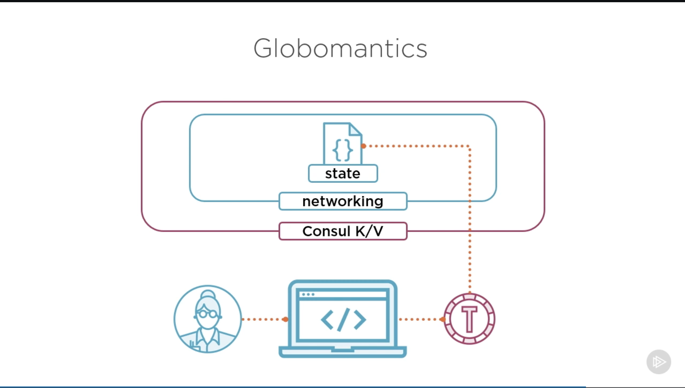
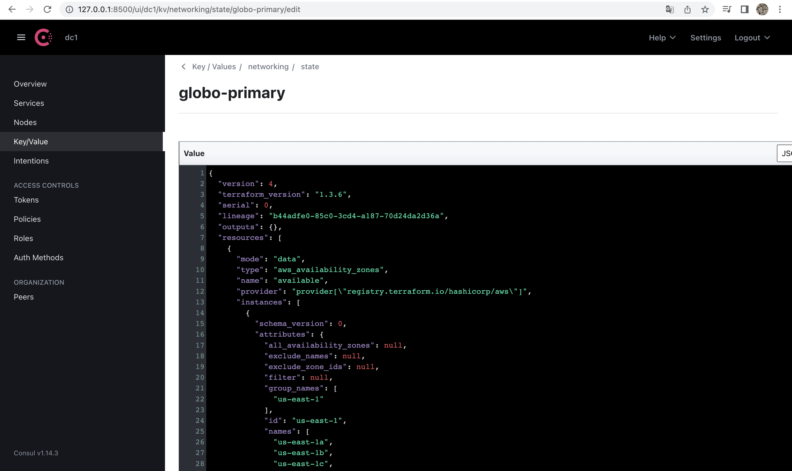

# Managing State in Terraform
Modulo 4

## Overview

- State data exploration
- Backend options for state data
- Migrating state data

## Globomantics environment
*Globomantic is the fictional company use for examples in the course*

* Work with the larger team
* Create infrastructure for other teams
* Enable collaboration through remote state
* Restrict access for other teams

## Backend plan



The plan is to set **Consul (by HashiCorp)** as the backend:
- [ ] Add a path called `networking` in the Consul K/V store
- [ ] Add a `state` path to store all state configuration as a key on that path
- [ ] Interact with consul through local workstation
- [ ] Set up **token** and supply as part of authentication
- [ ] Apply **policies** to restrict read and write operations to our data

## Setting up Consul

We'll be running Consul **locally**

First of all, [download Consul](https://developer.hashicorp.com/consul/downloads)

Then, set up `consul` directory and create a config file at `config/consul-config.hcl`
```
## server.hcl

ui = true
server = true
bootstrap_expect = 1
datacenter = "dc1"
data_dir = "./data"

acl = {
   enabled = true
   default_policy = "deny"
   enable_token_persistence = true
}
```

Create a `data` directory and run the command: 

`consul agent -bootstrap -config-file="config/consul-config.hcl" -bind="127.0.0.1"`

Generate the bootstrap token with command `consul acl bootstrap`, that generates something like this:
```
AccessorID:       962827e9-d32d-fa17-83ab-5836a97bc199
SecretID:         156cd53b-6c81-dbdc-9892-642ee3665dcd
Description:      Bootstrap Token (Global Management)
Local:            false
Create Time:      2023-01-04 18:45:37.590744 -0300 -03
Policies:
   00000000-0000-0000-0000-000000000001 - global-management
```

Export an environment variable `CONSUL_HTTP_TOKEN` with the `SecretID` value returned by the previous command, that we will use to access Consul
   - `export CONSUL_HTTP_TOKEN="156cd53b-6c81-dbdc-9892-642ee3665dcd"` in this example

Set up information inside Consul, **using Terraform**, so it can store our remote state with an [`main.tf`](./consul/main.tf) file.

`init`, `validate`, `plan` and `apply` this configurations to set up Consul. `main.tf` will show an output with accessor_ids for access the paths that were just created:

```
mary_token_accessor_id = "1a02db4b-0ea7-e146-767e-597787df4f2f"
sally_token_accessor_id = "a395dd41-415b-e5dd-4a82-5a011b6dad6d"
```

With this values, we can grab information about the credentials with the command: `consul acl token read -id ACCESSOR_ID`. For example:

```
❯ consul acl token read -id 1a02db4b-0ea7-e146-767e-597787df4f2f

AccessorID:       1a02db4b-0ea7-e146-767e-597787df4f2f
SecretID:         520acade-4610-7a68-9f36-d98e680a8c6e
Description:      token for Mary Moe
Local:            false
Create Time:      2023-01-04 18:56:31.015084 -0300 -03
Policies:
   73b9340c-e57b-8b61-aaf5-9c7e6c176b09 - networking
```

and

```
❯ consul acl token read -id a395dd41-415b-e5dd-4a82-5a011b6dad6d

AccessorID:       a395dd41-415b-e5dd-4a82-5a011b6dad6d
SecretID:         ec7e1826-3801-bf67-4de0-0ef933634b82
Description:      token for Sally Sue
Local:            false
Create Time:      2023-01-04 18:56:31.015085 -0300 -03
Policies:
   f8e632b7-1e09-99e9-d844-95d5ddd80187 - applications
```

The `**SecretID**` will be important for later.

### Consul UI

Access Consul UI at [127.0.0.1:8500](http://127.0.0.1:8500/ui/dc1/services), as configured, and **LogIn** with the global `SecretID`.

## Migrating Terraform State

**Process overview:**
 1. Update backend configuration
 2. Run `terraform init` (re-initialize configuration)
 3. Confirm state migration (it copies all the data from local to remote)
 4. That's it

**Performing the migration:**
1. Add a `backend.tf` file:
```
terraform {
  backend "consul" {
    address = "127.0.0.1:8500"
    scheme = "http"
  }
}
```
2. Set the `CONSUL_HTTP_TOKEN` to Mary Moe `SecretID`
   - `export CONSUL_HTTP_TOKEN="520acade-4610-7a68-9f36-d98e680a8c6e"`
3. Init terraform again and specify the path to store the state:
   - `terraform init -backend-config="path=networking/state/globo-primary"`


**Obs 1:** We don't need to specify any authentication information, because we are storing that in our environment variable

**Obs 2:** The `terraform.tfstate` will not be deleted, but it will be leave blank

**Obs 3:** this configuration is very basic. Could be using HTTPS to communicate with Consul and the Consul Server could be at a real remote location.

**Then**, access [Consul UI at K/V tab](http://127.0.0.1:8500/ui/dc1/kv). The state will be at `networking/state/globo-primary`, as configured.



