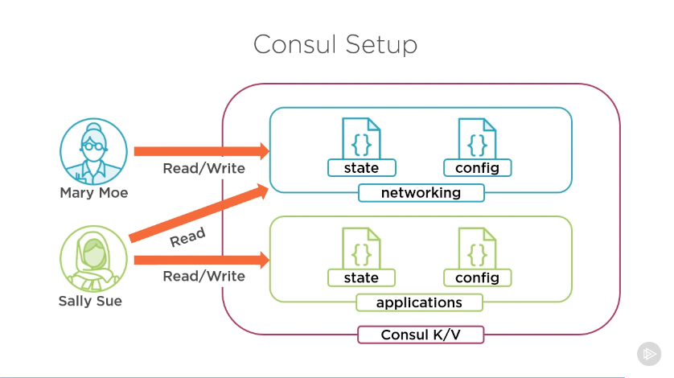

# Creating and using Data Sources and Templates
Modulo 5

## Overview

- Data source types
- Config from external sources
- Templates, templates, templates

**More Teams, More Problems**

- Information Security
  - Define roles, policies and groups
- Software Development
  - Read network configuration for app deployment
- Change Management
  - Store configuration data centrally

**Data sources**

- Glue for multiple configurations
- Resources are data sources
- Providers have data sources (such as AWS AZs and AMI, that we already used)
- Alternate data sources
  - Templates
  - HTTP (response in text or JSON)
  - External (script that returns valid JSON)
  - Consul

### Examples

#### HTTP Data Source

```
# Example data source
data "http" "my_ip" {
   url = "http://ifconfig.me"
}

# Using the response
data.http.my_ip.body
```

#### Consul Data Source
```
# Consul data source
data "consul_keys" "networking" {
   key = {
      name = "vpc_cidr_range"
      path = "networking/config/vpc/cidr_name"
      default = "10.0.0.0/16"
   }
}

# Using the response
data.consul_keys.networking.var.vpc_cidr_range
```

## Consul Setup



We created the `networking` path with `state` to store our state data. Now we are about to create a `config` path for use as a data source in our Terraform Configuration.

The `application` path will be use in a next module.

## Adding configuration data to Consul

Before running the commands to put our JSON configuration into Consul, we will need to set up the `CONSUL_HTTP_TOKEN` variable with "Mary Moe" `SecretID`. [02_managing_state_data](../02_managing_state_data/README.md) have the process step by step.

The `consul kv put` command writes the data to the given path in the Key/Vaylt store.

```
# Write the configuration data for globo-primary config
❯ consul kv put networking/configuration/globo-primary/net_info @globo-primary.json

❯ consul kv put networking/configuration/globo-primary/common_tags @common-tags.json
```

:warning: **Important:** the name of the file we want to copy the content into KV store **can't** contain undescore.

## Consuming data from Consul in Terraform config

1. Create variables to store `consul_address`, `consul_port` and `consul_datacenter`
2. Add the `consul` provider, specifying the `address` and the `datacenter`
```
provider "consul" {
  address    = "${var.consul_address}:${var.consul_port}"
  datacenter = var.consul_datacenter
}
```
3. Add the `data` block for `consul_keys`
```
data "consul_keys" "networking" {
  key {
    name = "networking"
    path = "networking/configuration/globo-primary/net_info"
  }
}
```
4. Get the network data decoding JSON with `jsondecode` Terraform function
```
locals {
  cidr_block      = jsondecode(data.consul_keys.networking.var.networking)["cidr_block"]
  private_subnets = jsondecode(data.consul_keys.networking.var.networking)["private_subnets"]
  public_subnets  = jsondecode(data.consul_keys.networking.var.networking)["public_subnets"]
  subnet_count    = jsondecode(data.consul_keys.networking.var.networking)["subnet_count"]
}
```

Then, the config stored in Consul will be available as local values.

## Applying Templates

We could use `template_file` to manage our subnets ids:
```
data "template_file" "public_cidrsubnet" {
  count = local.subnet_count

  template = "$${cidrsubnet(vpc_cidr,8,current_count)}"

  vars = {
    vpc_cidr      = local.cidr_block
    current_count = count.idex
  }
}

data "template_file" "private_cidrsubnet" {
  count = local.subnet_count

  template = "$${cidrsubnet(vpc_cidr,8,current_count)}"

  vars = {
    vpc_cidr      = local.cidr_block
    current_count = count.idex + 10
  }
}
```

So we could remove a lot of information from our Consul net_info key. The [./consul/globo-primary-2.json](./consul/globo-primary-2.json) had removed the subnet ids data, and we can apply that to Consul again running the same command that we used to put the JSON files there, that will replace our current file:
```
consul kv put networking/config/globo-primary/net_info @globo-primary-2.json
```

This makes things a little more dynamic.

:eight_pointed_black_star: **If it is necessary to change our CIDR block, we will not need to make changes to our configuration for all of the subnets**

To reference our `template_file` with public and private cidrsubnets:
```
data.template_file.private_cidrsubnet.*.rendered
data.template_file.public_cidrsubnet.*.rendered

# This returns all the strings, since we are using count argument
 # Since the VPC resource atrributes expect a list, we can use that way
```

:warning: **Terraform template_file seems to be deprecated a by the time I am using it** :warning:

Couldn't run it at Mac M1 2020 with the following errora after run `terraform init`:
```
╷
│ Error: Incompatible provider version
│ 
│ Provider registry.terraform.io/hashicorp/template v2.2.0 does not
│ have a package available for your current platform, darwin_arm64.
│ 
│ Provider releases are separate from Terraform CLI releases, so not
│ all providers are available for all platforms. Other versions of
│ this provider may have different platforms supported.
╵
```

At [Terraform Docs](https://registry.terraform.io/providers/hashicorp/template/latest/docs/data-sources/file) they recommend to use `templatefile` function instead.

Template notes was taken, but not applied in conifugration at January 05 2023.
