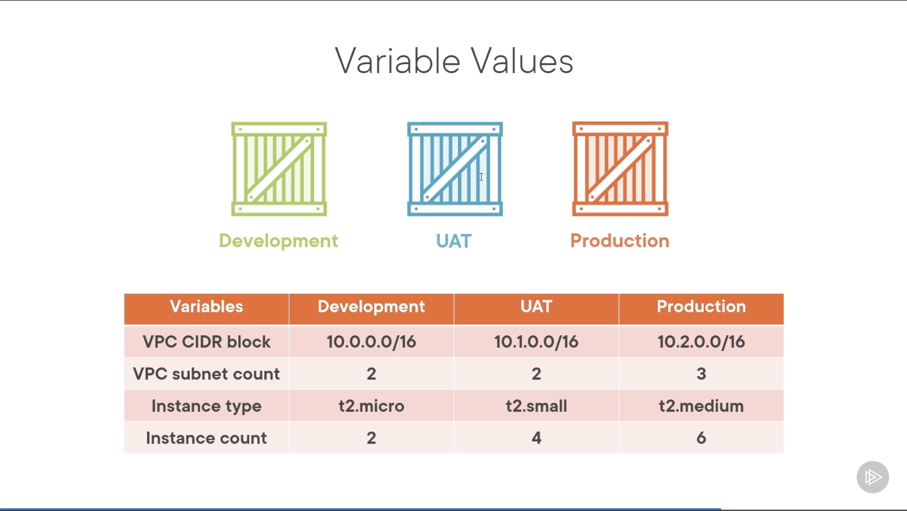

# Using Workspaces for multiple environments
Modulo 9

## Potential improvements
- Add a User Acceptance Test and Production environment to the existing Development environment
- Make sure to use the same configuration for each environment but suplying different input values depending on the environment
- Create the environments with the following configurations

## Sensitive data
 
* Variable file
* Environment variables
* Secrets service

:warning: State **can** contain sensitive data.
* Store state in a secure location

## Deploying the Development workspace

Commands:
* `terraform workspace new Development`
* `terraform workspace list`
* `terraform plan -out mv9dev.tfplan`
* `terraform apply mv9dev.tfplan`

## Deploying the UAT (User Acceptance Testing) workspace

Commands:
* `terraform workspace new UAT`
* `terraform workspace list`
* `terraform plan -out mv9uat.tfplan`
* `terraform apply mv9uat.tfplan`

